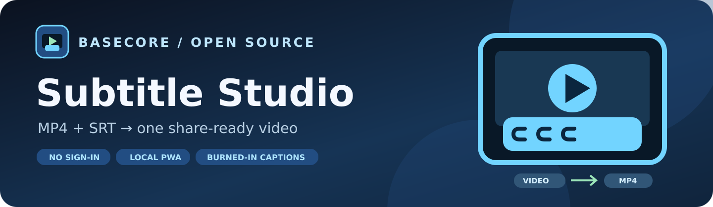
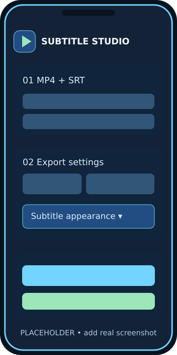
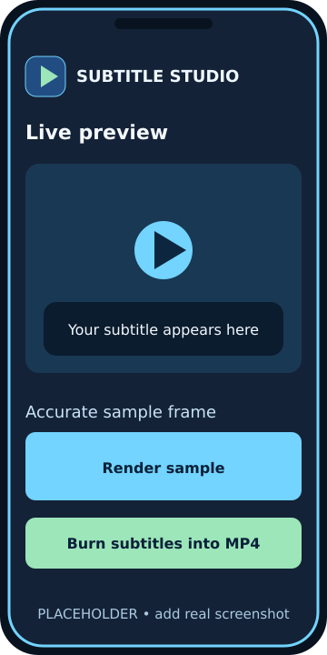

<h1 align="center">Subtitle Studio</h1>

<strong>Burn SRT subtitles into an MP4. Preview first. Share one finished video.</strong>

<a href="https://basecore.github.io/video-srt-merge/">▶ Open Web App</a> · <a href="https://github.com/basecore/video-srt-merge/issues">Report an issue</a> · <a href="mailto:basecore@gmx.de">Contact</a>

   

> **Your video stays on your device.** No account, no upload to a conversion server. The FFmpeg modules and font are downloaded from a CDN when needed.

## The story behind it

I wanted to send a friend **one video with subtitles already visible**. On Android I use [NewPipe](https://newpipe.net/) to download the video and SRT subtitles separately. I did not find a FOSS app that made the next step straightforward for me: I had significant difficulties with LibreCuts, and the online tools I tried were unreliable or required an account. So I had this browser-based tool created to burn the SRT into the MP4 locally and make the finished video easy to send.

Those difficulties describe **my experience**, not a claim that LibreCuts or every other tool fails for everyone. Subtitle Studio is an independent project: it is **not made by, affiliated with, or endorsed by NewPipe**. NewPipe itself is a very good, free and open-source Android viewer for YouTube and other supported services; it can download videos, audio and available subtitles. See [NewPipe's official GitHub repository](https://github.com/TeamNewPipe/NewPipe) and [official website](https://newpipe.net/). Download, modify and share only content you are allowed to use.

## At a glance

| | What you can do |
| --- | --- |
| **Preview first** | Scrub the SRT live overlay, then render an FFmpeg sample frame before starting a full encode. |
| **Burn subtitles** | Choose size, white/yellow text, outline, top/bottom position and margins. The text becomes part of the video image. |
| **Fix sync** | Shift subtitles by −10,000 to +10,000 ms without editing your original SRT. Positive means later; negative means earlier. |
| **Control output** | Original or max 1080p/720p/480p; quality CRF 19/23/27; optional AAC fallback for supported audio-copy failures. |
| **Work on Android** | Install the PWA, stop a running job, review the final MP4 and download it for sharing. |

## Two mobile screenshots

These are **illustrative placeholders, not actual app screenshots**. Replace them when real Android captures are available.

<table><tr><td align="center" width="50%"> <strong>1. Files &amp; subtitle settings</strong></td><td align="center" width="50%"> <strong>2. Live preview &amp; export</strong></td></tr></table>

To add real screenshots, place `editor-mobile.png` and `preview-mobile.png` in `assets/screenshots/`, then change only the two image paths above to `./assets/screenshots/editor-mobile.png` and `./assets/screenshots/preview-mobile.png`. Avoid committing personal or copyrighted video frames without permission.

## Quick start

1. Open the [Web App](https://basecore.github.io/video-srt-merge/) in a modern browser. It starts in English; select **Deutsch** in the language menu if preferred.
2. Select an `.mp4` video and its `.srt` subtitles. **File selection does not start encoding.**
3. Choose video resolution and quality; expand **Subtitle appearance & timing** for font style and the timing offset.
4. Use the live preview or **Render accurate sample frame** to inspect the text. Only then press **Burn subtitles & create MP4**.
5. If needed, **Stop processing** cancels the current job. Once done, check and download the video. For your NewPipe workflow, send the completed MP4 through your preferred Android sharing app.

## Install as a PWA

The app is hosted on GitHub Pages with relative manifest paths, an SVG logo, 192×192 and 512×512 PNG icons and a maskable icon. Use your browser's **Install app** action if offered. To deploy a fork: under **Settings → Pages**, choose **Deploy from a branch → main → /(root)**. The UI shell can be cached; video processing still requires internet to fetch FFmpeg and DejaVu Sans from jsDelivr. See `.github/workflows/build-icons.yml` for icon generation.

## Formats, limits and privacy

Subtitle Studio runs single-threaded FFmpeg.wasm (`@ffmpeg/ffmpeg` 0.12.15 and `@ffmpeg/core` 0.12.10) in the browser. It uses libass to render subtitles and H.264 to re-encode video; compatible audio is copied. If audio copying fails with a recognized MP4 audio/container error, the enabled-by-default fallback retries once with AAC at 160 kb/s. It does not retry unrelated encoding errors. On phones, large videos may exceed RAM or take a long time; first test a short clip. The CSS live overlay approximates output, while the FFmpeg sample frame uses the export's subtitle filter and scale. A fixed time offset cannot fix gradually drifting captions. The app has no automated browser end-to-end test.

Video and SRT are processed locally; they are **not** sent to GitHub or a conversion server. FFmpeg scripts/WASM, font files and optional README badge images are fetched from external CDNs when viewed or used. Your original SRT remains unchanged.

## Release notes

| Version | Date | Main change |
| --- | --- | --- |
| 1.3.2 | 2026-09-29 | Signed SRT offset, AAC retry for audio-copy errors, collapsible subtitle settings. |
| 1.3.1 | 2026-09-29 | Stop button and NewPipe-inspired project story. |
| 1.3.0 | 2026-09-29 | Manual export after preview and English/German UI. |
| 1.2.0 | 2026-09-28 | PWA, icons, export options and FFmpeg sample frame. |
| 1.1.x | 2026-09-28 | ESM loader, live preview and hardcoded subtitles. |
| 1.0.0 | 2026-09-28 | Selectable subtitle track. |

## License, credits and support

The app's own code is [MIT licensed](LICENSE); FFmpeg, FFmpeg.wasm, DejaVu Sans and NewPipe have their own licenses and authors. This project was developed with AI assistance through Perplexity. The exact underlying model and reasoning mode cannot be independently verified, so no model-specific authorship is claimed. Issues and ideas are welcome in [GitHub Issues](https://github.com/basecore/video-srt-merge/issues), or contact [basecore@gmx.de](mailto:basecore@gmx.de).

## Kurz auf Deutsch

Mit **NewPipe** lade ich Video und SRT getrennt herunter. Da mein Versuch mit LibreCuts schwierig war und die von mir probierten Online-Dienste unzuverlässig waren oder Anmeldung verlangten, habe ich Subtitle Studio erstellen lassen. Es brennt den Text nach einer Vorschau in eine einzelne MP4 ein, damit ich sie einem Freund schicken kann. NewPipe ist ein eigenständiges FOSS-Projekt und **nicht von mir**. [Offizielle NewPipe-Seite](https://newpipe.net/) · [Quellcode](https://github.com/TeamNewPipe/NewPipe).